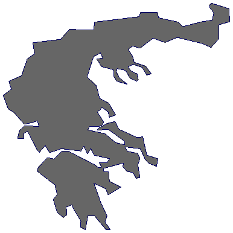
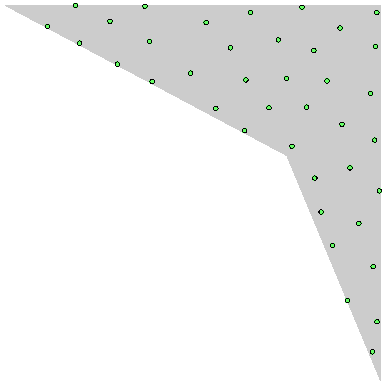
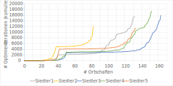
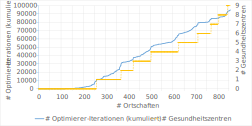
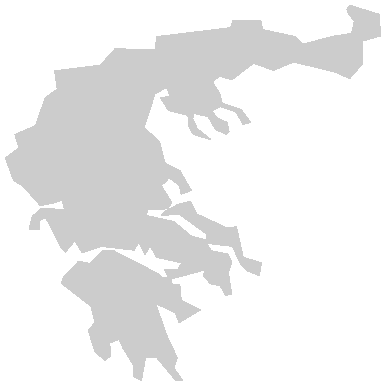

# Aufgabenstellung

In der Aufgabe wird nach einem Besiedlungsplan gesucht, der eine maximale Anzahl von Ortschaften im Gebiet platziert unter Berücksichtigung der Mindestabstände. Dazu soll es **genau ein** Gesundheitszentrum geben, da *"... genügend Geld zur Verfügung \[stehe\], um ein Gesundheitszentrum zu bauen"*.

In der Realität werden hingegen bei *Investitionsentscheidungen* der **Nutzen** und die **Kosten** gegenübergestellt. In diesem Fall ist also die Frage, wie viele weitere Ortschaften in den Besiedlungsplan korrekt aufgenommen werden können, wenn ein Gesundheitszentrum **zusätzlich** gebaut wird. Diese Frage muss für jede (sinnvolle) Zahl von Gesundheitszentren beantwortet werden. Darauf basierend kann der Planer den optimalen Besiedlungsplan wählen und umsetzen.

## Beispiel zur Aufgabenstellung

Für *ein gegebenes Gebiet* und *den Mindestabständen zwischen Ortschaften* werden folgende optimale Pläne *abhängig von der Zahl der Gesundheitszentren* gefunden:

| # Gesundheitszentren | # Ortschaften |
| --: | --: |
| 0 | 43 |
| 1 | 107 |
| 2 | 125 |
| 3 | 127 |

Das erste Gesundheitszentrum lohnt sich also, wenn seine Kosten den Nutzen $(107-43)=64$ zusätzlicher Ortschaften unterschreitet. Beim zweiten müssten die Kosten unter dem Nutzen $(125-107)=18$ zusätzlicher Ortschaften liegen. Und das dritte Gesundheitszentrum erlaubt nur $(127-125)=2$ weitere Ortschaften, seine Kosten übersteigen hier also wohl den Nutzen dieser beiden Ortschaften.

Während die ursprüngliche Aufgabestellung also nur eine Zeile der Tabelle fordert, wird die Aufgabenstellung so erweitert, dass nach der gesamten Tabelle gesucht wird.

# Ansatz

Der Besiedlungsplan wird *schrittweise* um *je eine Ortschaft* erweitert. Bei jedem Schritt werden die *Abstandsbedingungen* überprüft und der Plan so *optimiert*, dass diese Bedingungen alle erfüllt sind. Wenn dies auch nach mehrmaligen Versuchen nicht erfolgreich ist, wird *ein Gesundheitszentrum* hinzugefügt.

Die Kernpunkte des Ansatzes sind also wie folgt:
* **Optimierer**: Für einen gegebenen Plan werden Ortschaften und Zentren so lange innerhalb des Gebiets verschoben, bis alle Abstandsbedingungen erfüllt sind. Dazu werden in jeder Iteration Plankandidaten durch Punktverschiebung generiert. Diese Kandidaten werden anhand ihres *Loss* beurteilt, der sich aus der Summe fehlender Abstände zwischen Punktpaaren berechnet. Bei der gierigen Optimierung wird dann der Kandidat mit dem geringsten *Loss* für die nächste Iteration ausgewählt. Liegt der *Loss* bei Null, ist eine *zulässige* Lösung gefunden und die Optimierung beendet. Ansonsten wird die Optimierung mit einer *unzulässigen* Lösung *abgebrochen*, wenn die Zahl der Iterationen einen Schwellwert überschreitet oder seit zu vielen Iteration keine Verminderung des Loss eingetreten ist.
* **Lauf**: Startend von einem *leeren* Gebiet wird eine Ortschaft nach der nächsten *zufällig innerhalb* des Gebiets platziert. Wird der Plan dadurch *unzulässig*, werden die Planpunkte durch die *Optimierung* so *angepasst*, dass der Plan *zulässig* wird. Ist dies nicht möglich, wurde die Ortschaft eventuell an einer Engstelle platziert. Als eine Art *Backtracking* werden daher weitere *zufällige Platzierungen* für die neue Ortschaft ausprobiert (Lauf-Iteration). Scheitern diese Versuche, ist davon auszugehen, dass das Gebiet keine weitere Ortschaft aufnehmen kann. Daher wird ein *Gesundheitszentrum hinzugefügt* und mit der zufälligen Platzierung der neuen Ortschaft erneut begonnen. Der Lauf endet, wenn bereits so viele Zentren auf dem Plan sind, dass das gesamte Gebiet von ihnen praktisch abgedeckt werden könnte (in den Beispieldaten bei ca. drei Zentren der Fall).

Es ergibt sich die folgende *Ablauflogik*:

Für die Komplexitätsbetrachtung sind zwei Aspekte von Interesse. Hierfür sei die Zahl der *Ortschaften* $n$, der *Gesundheitszentren* $z$ und diejenige der *Eckpunkte des Gebietspolygons* $g$:
* **Loss-Berechnung**: Vorab ist in $O(n\cdot z)$ zu überprüfen, welche Orte von Zentren geschützt sind. Darauf basierend lässt sich für Ortspaare deren Abstand berechnen und auf Zulässigkeit überprüfen. Wird dies für *alle* Ortspaare gemacht, würde dies $O(n^2)$ an Aufwand bedeuten. Um das zu vermeiden, werden die Ortschaften in *Planquadrate* aufgeteilt, deren Seitenlänge der *strengsten* Abstandsregel entspricht (in der Aufgabenstellung also *20 km*). Dann müssen nur für Ortspaare *benachbarter* Planquadrate die Abstände berechnet und überprüft werden (auch diagonale Nachbarschaft berücksichtigt). Da sowohl die Zahl der Ortschaften pro Planquadrat als auch die Zahl benachbarter Planquadrate *konstant* ist, fällt nur der *assoziative Zugriff* auf Planquadrate mit $O(\log n)$ bei der Komplexitätsbetrachtung in Gewicht. Dies führt zum Aufwand von $O(n \log n)$ für die Ortspaare. Zusammen ergibt das $O(n\cdot (z+\log n))$.
* **Gebiet-Überprüfung**: Mit dem *Punkt-in-Polygon* Algorithmus erfordert die Überprüfung eines Punkts $Θ(g)$. Jeder Punkt wird so lange von seinem Ausgangspunkt verschoben, bis er innerhalb des Gebiets liegt. Da hierbei die Punktabstände nicht berücksichtigt werden, gibt es abhängig von der Gebietsform einen konstanten Faktor, der sich aus der Wahrscheinlichkeit vergeblicher Versuche ergibt. Dieser ist für die Komplexitätsklasse unerheblich. Da nicht immer alle Punkte bewegt werden und für unbewegte Punkte die Gebiet-Überprüfung schon erfolgt ist, liegt der Aufwand für einen Plankandidaten somit bei $O(g\cdot (n+z))$.

Daraus ergibt sich folgende Komplexität für die Elemente der Ablauflogik:
* *Optimierer-Iteration:* Die Zahl der Kandidaten ist durch Konstanten festgelegt. Damit ergibt sich die Komplexität direkt aus der Kombination der *Loss-Berechnung* und der *Gebiet-Überprüfung*, also: $$O\bigl(n\log n + n\cdot (g+z)+g\cdot z\bigr)$$
* *Lauf-Iteration:* Auch hier ist durch Konstanten festgelegt, wie viele Iterationen maximal vom Optimierer durchlaufen werden und wie viele Platzierungen der neuen Ortschaft versucht werden dürfen. Die Komplexität ist also dieselbe wie die einer *Optimierer-Iteration*.
* *Gesamter Lauf:* Der Besiedlungsplan durch schrittweiser Hinzunahme von Ortschaften aufgebaut. Wenn $n$ die Ortschaften der abschließenden Lösung darstellt sind also $Θ(n)$ Schritte obiger Komplexität durchzuführen. Dabei ist unerheblich, dass $n$ anfangs kleiner ist, da dies im Schnitt nur einen konstanten Faktor ausmacht. Für die Komplexität des gesamten Laufs gilt also: $$O\bigl(n^2\log n + n^2\cdot (g+z)+n\cdot g\cdot z\bigr)$$

Prinzipiell gibt es auch alternative Lösungsansätze, die hier nicht weiter verfolgt werden. Dies liegt an Folgendem:
* **Analytische** bzw. **konstruierende** Ansätze sind wenig vielversprechend. Dies liegt an der Form der Siedlungsgebiete, die nicht einmal *konvex* sind. Eine Ausnahme ist das quadratische Siedlungsgebiet von *Siedler3*. Aber selbst hier lässt sich nur dann beweisbar optimal konstruieren, wenn kein Gesundheitszentrum verwendet wird.
* Die Verwendung von **Loss-Gradienten** *("Abstoßung")* bei der Punktverschiebung ist schwierig, da dann auch der Verbleib / die Rückkehr in die Gebietsgrenzen *("Anziehung")* mathematisch erfasst werden müsste. Daher wird auf sie verzichtet. Dennoch ist die Optimierung *zielgerichtet*, da der stetige Loss für die Kandidatenauswahl verwendet wird. Insofern bekommt der Optimierer selbst bei unzulässigen Planen ein Hinweis darauf, welcher Kandidat die Punkte am meisten in die richtige Richtung verschoben hat.
* Die vorgestellte Methode zur Planwahl einer Optimierer-Iteration ist *gierig*. Dies würde ein Problem darstellen und potenziell zu *lokalen Optima* führen, wenn Folgepläne anhand der *Gradienten* deterministisch bestimmt würden. Dies aber nicht der Fall ist, da Planpunkte *zufällig* bewegt werden. Daher kann auf zusätzliche Methoden der Planwahl (z.B. *Annealing*) verzichtet werden.

# Design

Um die Abbildung zu vereinfachen, ist im UML Klassendiagramm Folgendes weggelassen:
* Hole-Methoden: durch die Attributauflistung nicht zwingend erforderlich.
* Inhalt des Files "types.py", da dieser nur TPunkt (siehe unten) enthaelt.
* Override von Standard-Methoden (lt, str): im Modell standardmässig durchgeführt
* Konstruktoren: nur aufgelistet, wenn ihre Parameter sich maßgeblich von den Attributen unterscheiden.
* konstante Variablen, wie zum Beispiel im "Plotter" die Farben der gueltigen Ortschaften.

Außerdem wird für den Typ einen Punkt `tuple[float, float]` ein spezifischer Typ `TPunkt` verwendet. Mit Punkt sind alle Modellpunkte gemeint, also Ortschaften, Gesundheitszentren und Polygonecken.
`+/-` vor den Attributen bedeutet, dass das Attribut von außen nicht veränderbar ist, jedoch auf den Inhalt des Attributs durch die Hole-Methoden Zugriff hat.

Die Unterklassen von Beobachter werden in einem separaten Schaubild dargestellt.

Die verschiedenen Unterklassen von Beobachter sind für die Verfolgung und Protokollierung des Laufs und Optimierers zuständig. Sie sind im folgenden Schaubild dargestellt.

# Durchführung: Erstellung der Besiedlungspläne

Die fünf vorgegebenen *Siedlungsgebiete* haben sehr reguläre Formen, die sich zur Untersuchung gewisse Aspekte des Ansatzes sehr gut eignen. Was allerdings fehlt, ist ein Siedlungsgebiet, das insofern *realistisch* ist, als dass es die *Unförmigkeiten* von Landesgrenzen oder Küstenverläufen abbildet. Dazu eignet sich das *griechische Festland* mit seinen *zerklüfteten Küsten* und *konkaven Elementen* hervorragend. Außerdem ist zu untersuchen, wie gut der Lösungsansatz mit der Komplexität des Gebiets und der verfügbaren Fläche *skaliert*.

Dafür wurde ein *sechstes* Gebiet erstellt und der Evaluationsreihe hinzugefügt. Seine Koordinaten sind im *korrekten* Maßstab (km) angegeben, womit die Abstandsregeln (10 km, 20 km, 85 km) besser *veranschaulicht* werden und eine viel größere Fläche als in den vorgegebenen Gebieten zu besiedeln ist (Achse von Nord-Süd und West-Ost ist knapp *600 km*). Außerdem besteht sein Polygon aus *165* Eckpunkten, was weitaus mehr als die *4-22* Eckpunkte der vorgegebenen Gebiete ist. Damit lässt sich die *Skalierbarkeit* der Polygon-Algorithmen auf die Probe stellen.

|  |
| :--: |
| Zusätzliches Siedlungsgebiet: Griechisches Festland als *165-Eck* im korrekten Maßstab *(km)*,   also mit einer Achsenlänge von *fast 600* |

Für jedes Siedlungsgebiet wurde je ein Optimierungslauf auf einem Desktop PC mit dem *AMD FX8330* Prozessor durchgeführt. Dabei wurde Standard-Python im Terminal verwendet und auf Compilierung mit etwa *Cython* oder *PyPy* verzichtet. Die Dauer pro Lauf ist wie folgt:

| Gebiet | Siedler1 | Siedler2 | Siedler3 | Siedler4 | Siedler5 | Griechenland |
| -- | --: | --: | --: | --: | --: | --: |
| Dauer / min | 83 | 62 | 103 | 132 | 68 | 2851 |

# Ergebnisse

## Vorgegebene Siedlungsgebiete

In der Aufgabenstellung wird nach dem Zusammenhang gefragt zwischen der Zahl der verfügbaren Gesundheitszentren und der Anzahl der Ortschaften, die damit zulässig platziert werden können. Dies wird in der folgenden Tabelle und dem Schaubild festgehalten.

| # Gesundheits- zentren | # Ortschaften   @ Siedler1 | # Ortschaften   @ Siedler2 | # Ortschaften   @ Siedler3 | # Ortschaften   @ Siedler4 | # Ortschaften   @ Siedler5 |
| --: | --: | --: | --: | --: | --: |
| 0 | 39 | 37 | 49 | 49 | 41 |
| 1 | 109 | 81 | 158 | 132 | 128 |
| 2 | 129 | 81 | 162 | 150 | 131 |
| 3 | 132 | 83 | 163 | 152 | 133 |

Die zugehörigen Plankarten sind im Folgenden abgebildet. Sie sind auf eine *quadratische* Zeichenfläche normalisiert. Die unterschiedlichen *Zoomfaktoren* in x/y-Richtung werden z.B. bei *Siedler4* und *Siedler5* durch die *elliptischen* Schutzgebiete der Gesundheitszentren deutlich. Die Plan-Rohdaten finden sich in `output/siedler*/gierig/lauf/plandaten`.

| Gebiet | *Kein* Zentrum | *Ein* Zentrum | *Zwei* Zentren | *Drei* Zentren |
| -- | -- | -- | -- | -- |
| Siedler1 |  |  |  |  |
| Siedler2 |  |  | |  |
| Siedler3 |  |  |  |  |
| Siedler4 |  |  |  |  |
| Siedler5 |  |  |  |  |

Aus den Plankarten lassen sich folgende Erkenntnisse gewinnen:
* *Gesundheitszentren* werden im Zuge des Lauf in sinnvolle Positionen verschoben. So ist z.B. für *Siedler5* das erste Gesundheitszentrum *mittig* angelegt, während beim Hinzufügen eines zweiten beide Zentren sich auf beide Seiten *verteilen*. Dies beweist den Kerngedanken des Lösungsansatzes, dass auch ohne *Gradienten* nur basierend auf *Loss* eine **zielgerichtete Optimierung** stattfinden kann. Das gilt auch für bereits platzierte Ortschaften und wird aus den Optimierungsverläufen klarer deutlich. Detailliertere Beispiele aus dem Anhang:
	* *Schleichende Migration*: Das erste Gesundheitszentrum von *Siedler1* fängt am Rand an und bewegt sich dann in Richtung Mitte. Die verkürzte Darstellung des Laufes ist [hier](#siedler-1).
	* *Überwinden von Gebietslücken:* Auch *Lücken* im Gebiet werden erfolgreich übersprungen. Ein Beispiel für *Siedler5* ist [hier](#siedler5-bei-128-130-ortschaften-und-1-2-gesundheitszentren) und für das *griechische Festland* [hier](#griechisches-festland-bei-813-ortschaften-und-8-gesundheitszentren).
* Die *spitzen Ecken* von *Siedler2* und *Siedler4* sind an sich vielversprechende Punkte für das Setzen der Ortschaften. Jedoch ist der hier verfolgte Lösungsansatz **generisch** gehalten. Er besitzt also *keine Sonderlogik*, um solche Ecken zu erkennen und zu berücksichtigen. Als Folge davon nutzen die erstellten Besiedlungspläne den Platz um die spitzen Ecken nicht immer voll aus.
* Die *Zufälligkeit* des Laufs und Optimierers wird z.B. in *Siedler2* deutlich. Dort wären die Besiedlungspläne ab *82* Ortschaften auch für nur *1* Gesundheitszentrum möglich gewesen. Auch bei anderen Plänen ist also davon auszugehen, dass minimal bessere Besiedlungspläne bei erneutem Durchlauf gefunden werden könnten. Dennoch ist das **Optimierungsergebnis** in der Hinsicht **robust**, dass der Zufall nur einen kleinen Einfluss auf die Zahl der erreichten Ortschaften hat ($\pm 2\%$ bei *Siedler2*).

Der Schwierigkeitsgrad der Optimierung steigt mit der Zahl der Ortschaften. Wenn die Optimierung zu schwierig wird, sorgt die Budgetierung des *Laufs* und des *Optimierers* dafür, dass ein Gesundheitszentrum hinzugefügt oder der Lauf beendet wird. Dies wird im folgenden Schaubild veranschaulicht. Als Schwierigkeitsgrad wird hierbei die Zahl der *Optimierer-Iterationen* genommen, die zwischen zwei *zulässigen* Besiedlungsplänen benötigt wurden. Dies berücksichtigt sowohl die Neuplatzierungen der zusätzlichen Ortschaft als auch die nachfolgenden Punktbewegungen des Optimierers. Es werden jeweils die Stammfunktionen gezeigt, da die Verläufe sich sonst oft überschneiden würden. Die *Steigung* der Verläufe zeigt also den *Schwierigkeitsgrad*.

Wie erwartet steigt der Schwierigkeitsgrad *vor* Hinzunahme des Gesundheitszentrums. *Danach* ist er wieder minimal, außer wenn keine zusätzliche Abdeckung durch das Gesundheitszentrum erzielt werden kann. Außerdem lässt sich erkennen, dass der erhöhte Schwierigkeitsgrad nicht abrupt einsetzt, sondern sich kontinuierlich aufbaut. Dies ergibt sich daraus, dass die Wahrscheinlichkeit, eine zulässige Lösung ohne Hinzunahme eines weiteren Gesundheitszentrums zu finden, stetig abnimmt.

## Zusätzliches Siedlungsgebiet

Auch für das *griechische Festland* als *realitätsnäheres* und *größeres* Siedlungsgebiet sind die Ergebnisse im Folgenden festgehalten.

Die Laufzeit ist um den *Faktor* **21,6** länger als die längste Laufzeit der vorgegebenen Siedlungsgebiete (*2851 min* statt maximal *132 min*). Dies liegt unter dem Faktor, der aufgrund obiger *Komplexitätsbetrachtung* zu erwarten wäre. Im Einzelnen sind die *eingehenden Faktoren*:
* Ortschaften ($n$): Faktor **5,2** (*851* statt maximal *163*)
* Gesundheitszentren ($z$): Faktor **3,0** (*9 statt 3*)
* Gebietseckpunkte ($g$): Faktor **7,5** (*165* statt maximal *22*)

Die folgende Tabelle hält den Zusammenhang fest zwischen der Zahl der verfügbaren Gesundheitszentren und der Anzahl der Ortschaften, die damit zulässig platziert werden können. Da das Siedlungsgebiet größer ist, tritt erst bei knapp *10* Gesundheitszentren eine Sättigung der möglichen Ortschaftszahl ein. Daher wurden auch mehr Werte als bei den vorgegebenen Siedlungsplänen ermittelt.

| # Gesundheits- zentren | # Ortschaften   @ Griechisches Festland |
| --: | --: |
| 0 | 257 |
| 1 | 366 |
| 2 | 420 |
| 3 | 499 |
| 4 | 621 |
| 5 | 707 |
| 6 | 765 |
| 7 | 800 |
| 8 | 838 |
| 9 | 851 |

Die zugehörigen Plankarten sind im Folgenden abgebildet.

| #&nbsp;Zentren | 0 | 1 | 2 | 3 | 4 |
| :--: | :--: | :--: | :--: | :--: | :--: |
| 0+ |  |  |  |  |  |
| 5+ |  |  |  |  |  |

Aus den Plankarten lassen sich folgende Erkenntnisse gewinnen:
* Die *konkaven* Elemente und der *stark zerklüftete* Küstenverlauf des Siedlungsgebiets werden durch den Lösungsansatz sehr gut *berücksichtigt*. Dies zeigt sich z.B. an der Ausnutzung der anspruchsvollen Halbinseln [Chalkidiki](https://de.wikipedia.org/wiki/Chalkidiki) und den [Peloponnes](https://de.wikipedia.org/wiki/Peloponnes).
* Die größere Siedlungsfläche zeigt allerdings *Schwächen* bei der Platzierung der *Gesundheitszentren* auf. Werden diese initial *schlecht* platziert (z.B. in [Thrakien](https://de.wikipedia.org/wiki/Thrakien_(geographische_Region_Griechenlands)) statt in Zentralgriechenland), kann selbst die Punktbewegung der Optimierung dies *nur zum Teil* korrigieren und führt lediglich zu *lokalen Optima*. Dass diese gefunden werden, liegt an der verfolgten Strategie bei der *Bewegung* der Gesundheitszentren. Immer *alle oder keine* zu bewegen, entfällt als Option, da sonst bei den bereits *gut platzierten* Gesundheitszentren sehr wahrscheinlich *Lücken* entstehen würden. Stattdessen berücksichtigt der Optimierer dedizierte Kandidaten, in denen nur genau ein zufälliges Gesundheitszentrum (und keine Ortschaft) bewegt wird.

Zum Abschluss kombiniert das folgende Schaubild für eine variable Anzahl von zulässig platzierten Ortschaften zwei Aspekte: Zum einen wird die Zahl der dafür benötigten Gesundheitszentren angegeben. Zum anderen wird der *Schwierigkeitsgrad* der Hinzunahme einer Ortschaft wie zuvor durch die Zahl der dafür notwendigen *Optimierer-Iterationen* genommen.

# Beispiele

## Optimierer

Die folgenden Kartenreihen zeigen beispielhaft den Verlauf der Optimierung. Bei jeder *Iteration* werden mögliche Kandidaten durch *Punktverschiebung* geschaffen und anhand ihres *Loss* bewertet.

Die lila Punkte sind Ortschaften, die von keinem Gesundheitszentrum abgedeckt werden und zu nah aneinander liegen.

### *Siedler5* bei *128-130* Ortschaften und *1-2* Gesundheitszentren

Dieses Beispiel zeigt, wie Punkte (in diesem Fall das Gesundheitszentrum) erfolgreich *Gebietslücken* überwinden können. Dazu führt im Beispiel die (zufällige) Platzierung der Ortschaften Nummer *129* links unten und *130* links oben.

| vor Ortschaft *129* | Iteration *129.1* | Iteration *130.1* | Iteration *130.2* |
| :--: | :--: | :--: | :--: |
|  |  |  |  |

### *Griechisches Festland* bei *813* Ortschaften und *8* Gesundheitszentren

Dieses Beispiel zeigt, wie die Verschiebung eines Gesundheitszentrums über den [Argolischen Golf](https://de.wikipedia.org/wiki/Argolischer_Golf) hinweg zur Abdeckung einiger ungeschützter Ortschaften führt.

| Iteration *1* | Iteration *2* | Iteration *3* |
| :--: | :--: | :--: |
|  |  |  |
| *Loss ≈ 11,405* | *Loss ≈ 2,518* | *Loss=0* |

## Lauf

Die folgenden Kartenreihen zeigen beispielhaft den schrittweisen Aufbau des Besiedlungsplans im *Lauf*. Bei jeder *Iteration* wird eine zusätzliche Ortschaft hinzugefügt und der Plan wird (soweit möglich) durch *Optimierung* zulässig.

### *Siedler 1*

Der Lauf endet bei Iteration *132*. Dieser letzte Plan ist im Feld für *140* dargestellt.

| Iteration | 10 | 20 | 30 | 40 | 50 |
| --: | --: | --: | --: | --: | --: |
| 0+ |  |  |  |  |  |
| 50+ |  |  |  |  |  |
| 100+ |  |  |  |  | |

### *Griechisches Festland*

Der Lauf endet bei Iteration *851*. Dieser letzte Plan ist im Feld für *860* dargestellt.

| Iteration | 0 | 20 | 40 | 60 | 80 |
| --: | --: | --: | --: | --: | --: |
| 0+ |  |  |  |  |  |
| 100+ |  |  |  |  |  |
| 200+ |  |  |  |  |  |
| 300+ |  |  |  |  |  |
| 400+ |  |  |  |  |  |
| 500+ |  |  |  |  |  |
| 600+ |  |  |  |  |  |
| 700+ |  |  |  |  |  |
| 800+ |  |  |  |  |  |
